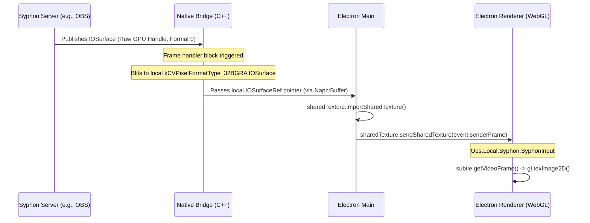
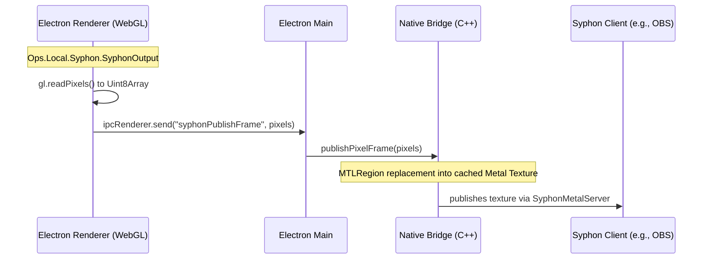

# cables-electron-syphon

Native macOS Apple Syphon bridge for Electron and Node.js. This module facilitates high-performance, GPU-accelerated, and real-time video sharing between Cables Standalone and other Syphon-compatible applications (such as OBS Studio, MadMapper, Resolume, or custom VJ tools) on macOS.

---

## Architecture & Data Flow

The bridge operates in two directions (Input and Output) using a hybrid CPU/GPU workflow tailored to the security and sandboxing constraints of Chromium/Electron.

### 1. Syphon Input (Zero-Copy GPU Handoff)

This pipeline brings external Syphon feeds into Cables entirely on the GPU:

1. **Syphon Client**: The native C++ wrapper (`SyphonMetalClient`) listens for frames published by selected Syphon servers.
2. **Pixel Format Correction**: Syphon servers often publish surfaces without specifying a standard pixel format (returning `0` / undefined format). Chromium's internal texture validation strictly requires an explicit pixel format (like `'BGRA'`). To solve this, the bridge allocates a local `IOSurface` with `kCVPixelFormatType_32BGRA`, wraps it in a Metal texture, and copies (blits) the incoming frame onto it using a GPU-accelerated blit command encoder (`MTLBlitCommandEncoder`).
3. **Main Process Handoff**: The local `IOSurfaceRef` pointer is wrapped in a `Napi::Buffer` and sent to the main process. We retain the surface (`CFRetain`) in C++ and register a finalizer on the Napi buffer to release it (`CFRelease`) when JavaScript's garbage collector frees the buffer, avoiding memory leaks.
4. **Renderer Injection**: The main process imports the surface using Electron's experimental `sharedTexture.importSharedTexture()` API and routes it to the specific subframe of the editor (`event.senderFrame`) where the `SyphonInput` Op is running.
5. **WebGL Upload**: The Op wraps the imported texture in a WebGL-compatible `VideoFrame` on the GPU and uploads it using `gl.texImage2D()`.

### 2. Syphon Output (Op-Centric Streaming)

This pipeline publishes WebGL textures from the Cables editor to the system:

1. **Op Capture**: Inside the editor, the user places a `SyphonOutput` Op and connects a texture. The Op binds a WebGL Framebuffer and calls `gl.readPixels()` to copy the texture to a reusable `Uint8Array` buffer.
2. **IPC Pipeline**: The pixel array is sent via Electron IPC. Electron serializes the TypedArray into a Node `Buffer` in the Main process.
3. **Texture Upload**: In the main process, the native bridge uploads the pixel buffer to a cached Metal texture (`g_ServerTexture`) using `replaceRegion`. Reusing the same texture object across frames avoids heavy reallocation overhead.
4. **Syphon Publish**: The texture is published system-wide via `SyphonMetalServer`. Since WebGL's coordinates are flipped vertically compared to Metal/Syphon, we publish with `flipped: NO` to let the system automatically orient the frame correctly.

---

## File Description

*   [**`binding.gyp`**](binding.gyp): The compilation descriptor for `node-gyp`. It configures compiler/linker options for macOS:
    *   Links macOS system frameworks (`Foundation`, `Metal`, `IOSurface`, `CoreVideo`).
    *   Configures compilation for Objective-C++ (`-ObjC++` and standard library settings).
    *   Points to the prebuilt `Syphon.framework` directory and configures RPATHs so the compiled module can load the framework at runtime in development and production builds.
*   [**`syphon_bridge.mm`**](syphon_bridge.mm): Objective-C++ native addon core implementation. It sets up the Metal context, manages the thread-safe callbacks, handles the GPU texture blitting, and exposes the Node-API bindings.
*   [**`index.js`**](index.js): Entry point of the package. It uses Node's `module.createRequire` to safely load the binary `.node` addon in ES module environments and exports the bridge.
*   [**`package.json`**](package.json): Defines the local Node package, declarations, dependencies, and compilation scripts.

---

## Bridge API Methods

The native module exports the following functions:

### Clients (Input)
*   **`getServers()`**: Returns an array of dictionaries describing all active Syphon servers on the system.
*   **`initClient(serverDescription, callback)`**: Initializes a connection to a Syphon server. The `callback` is called on every new frame with parameters: `(ioSurfaceBuffer, width, height)`.
*   **`stopClient()`**: Stops the client and releases all associated resources.

### Servers (Output)
*   **`initServer(name)`**: Initializes a Syphon server with a given name.
*   **`publishFrame(buffer, width, height)`**: (Legacy/GPU) Publishes an `IOSurfaceRef` pointer passed as a buffer.
*   **`publishPixelFrame(buffer, width, height)`**: (Main) Publishes a raw CPU pixel buffer (`RGBA` bytes) to the active Syphon server.
*   **`stopServer()`**: Stops the server and releases all associated resources.
